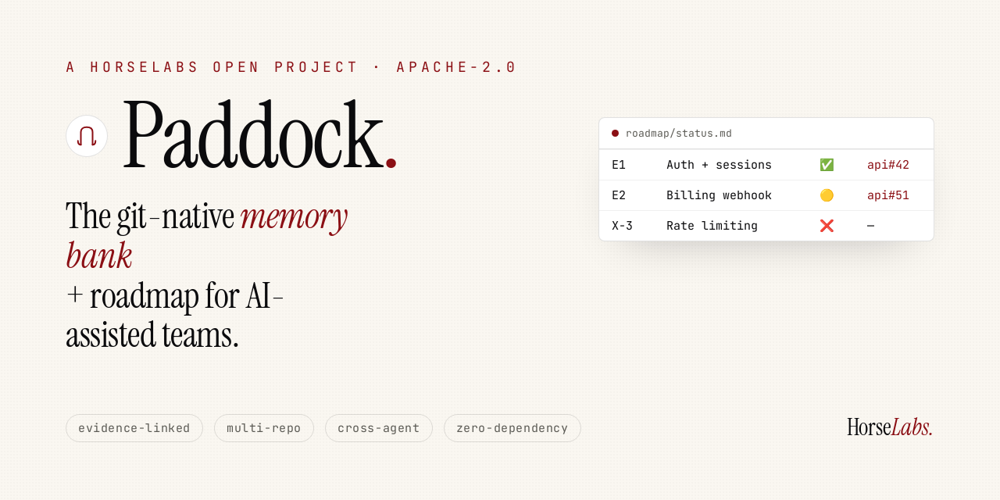

<p align="center">
  <a href="https://horse-labs.github.io/paddock/"></a>
</p>

<h1 align="center"> Paddock</h1>

<p align="center"><strong>The git-native memory bank + roadmap for AI-assisted teams — evidence-linked, multi-repo, with delivery guardrails.</strong></p>

<p align="center">
  <a href="https://github.com/horse-labs/paddock/actions/workflows/ci.yml"></a>
  <a href="LICENSE"></a>
  <a href="https://github.com/horse-labs/paddock/releases"></a>
  <a href="https://github.com/horse-labs/paddock/generate"></a>
  <a href="https://horse-labs.github.io/paddock/"></a>
  
</p>

<p align="center">
  <a href="https://horse-labs.github.io/paddock/">Landing</a> ·
  <a href="FRAMEWORK.md">Framework</a> ·
  <a href="docs/getting-started.md">Get started</a> ·
  <a href="CHANGELOG.md">Changelog</a> ·
  <a href="CONTRIBUTING.md">Contributing</a> ·
  <a href="SECURITY.md">Security</a>
</p>

---

🌐 **[horse-labs.github.io/paddock](https://horse-labs.github.io/paddock/)** — what it is, how to use it, why adopt it (EN/pt).

> Um paddock é o cercado onde o cavalo é preparado antes de correr. Aqui é onde o **projeto** é
> preparado e governado: a memória viva, o status canônico e o ritual que mantêm humano + IA no mesmo
> mapa — versionado no git, ligado ao código por evidência.

### Memory bank — e além
A categoria já tem nome: **memory bank** (markdown no repo, alimentado ao agente a cada sessão pra
restaurar contexto). Paddock **é** isso no core — mas vai **além** do memory bank típico (que só restaura
contexto, geralmente num repo só). Ele adiciona a camada de **governança de engenharia**:
- **Roadmap/status com evidência ligada ao código** — não só "o que o projeto é", mas **o que está feito /
  pendente**, cada item linkado a PR/commit/ADR. (memory bank vira *fonte de verdade do progresso*.)
- **Disciplina de entrega** — ritual de sessão + **DoR/DoD** + git stance (não só contexto: **processo**).
- **Workspace multi-repo + refinaria** — vários repos + `_knowledge/` bruto destilado em estrutura (a maioria
  dos memory banks é single-repo e só-contexto).
- **Cross-agent** — `AGENTS.md` (Copilot/Cursor/Codex/Claude), não amarrado a uma ferramenta.

Em uma linha: **memory bank que também é roadmap + governança, com evidência até o código.**

Paddock é um **template de repositório** (não um produto, não uma dependência pesada). Você clica em
*"Use this template"*, preenche o esqueleto, e ganha:

- **Status canônico** (`roadmap/status.md`) — a fonte única do que está feito / em andamento / pendente,
  cada linha com **evidência** (link de PR/commit/ADR). Sem evidência, não é status — é alegação.
- **Ritual de sessão** (`FRAMEWORK.md`) — protocolo curto que mantém o status acurado a cada sessão de
  trabalho (com pessoas ou com agentes de IA tipo Claude Code, Cursor, Aider…).
- **Memória estruturada** — `specs/`, `plans/`, `decisions/`, `audits/` linkados pelo status, não
  duplicados. O contexto do projeto para de viver só na cabeça de alguém (ou na janela de contexto do agente).
- **Panorama visual** sob demanda (`tools/report.sh`) + **lint de integridade** (`tools/lint-status.sh`).

## Por que existe

Trabalho assistido por IA gera muito contexto que **se perde** entre sessões: decisões, roadmap, o "porquê".
Drive/Notion desatualizam e a IA não lê/escreve neles nativamente. Paddock põe a memória **dentro do git** —
diffável, revisável por PR, lida e escrita pelo agente, e amarrada ao código por evidência. É **governança
do seu desenvolvimento**, leve.

## Workspace (o modelo mental — leia antes)
Paddock não é ilha: vive numa **raiz de trabalho** ao lado dos repos e do material bruto. O agente roda
da raiz e cruza memória + código + matéria-prima de uma vez.
```
  ~/workspace/                 ← raiz; o agente roda daqui
  ├── paddock/                 ← MEMÓRIA estruturada (este framework)
  ├── repo-a/  repo-b/         ← repos de código do projeto
  └── _knowledge/              ← INTAKE bruto: pdf, transcrições, drawio… (privado, não-versionado)
```
Paddock vira **refinaria**: destila o entulho de `_knowledge/` em estrutura (`specs/`/`decisions/`/`status.md`).
O `setup.sh` gera um **`AGENTS.md`** na raiz (adapter lido por **GitHub Copilot, Cursor, Codex**; copie p/
`CLAUDE.md` no Claude Code). Funciona com qualquer agente — o core é markdown+git.
Setup completo + ritual de ingest + matriz de ferramentas: **[`docs/workspace-setup.md`](docs/workspace-setup.md)**.

## Compartilhado pelo time
A instância Paddock do seu projeto (o repo gerado do template, ou um fork) é **git** — então **toda a
memória é compartilhada por todo o time**. Cada membro clona o mesmo repo e tem o **mesmo contexto**:
decisões, roadmap, status, o porquê. Onboarding de um dev novo = `git clone` + ler `roadmap/status.md` —
sem conhecimento tribal, sem "pergunta pro fulano". Atualiza igual código: `git pull` antes da sessão,
**commit/PR** depois. Trabalho paralelo (vários devs/agentes) = branch/PR como em qualquer repo
(ver `FRAMEWORK.md`). O contexto do projeto deixa de viver numa cabeça (ou na janela de um agente) e passa
a viver no git, **versionado e visível pra todos**.

## Quickstart

```bash
# Linux/macOS: terminal nativo. Windows: rode no Git Bash (vem com o Git) ou WSL.
# 1. "Use this template" no GitHub  →  seu-org/seu-projeto-workbench
# 2. clone e rode o setup
git clone <seu-repo> && cd <seu-repo>
bash setup.sh                  # aplica o nome do projeto, chmod nos scripts, valida (lint)
# 3. abra roadmap/status.md, registre seus primeiros itens
# 4. a cada sessão, siga o FRAMEWORK.md
```
> Os scripts (`setup`/`report`/`lint`) são **opcionais** — o core é markdown + git e funciona em qualquer
> SO sem rodar nada. No Windows, rode os scripts via **Git Bash**/WSL.

Detalhe em [`docs/getting-started.md`](docs/getting-started.md).

## Dependências
`bash` · `git` · `gh` (GitHub CLI, p/ linkar PRs) · `grep`/`sed` (POSIX). **Zero runtime** (sem node/python).
Ver [`docs/tooling.md`](docs/tooling.md).

## O que NÃO é
- Não é spec-driven dev (tipo GitHub Spec Kit) — é mais amplo: **memória + status + roadmap + ritual**,
  spec é só uma das pastas.
- Não é um CLI/produto a instalar — é estrutura + metodologia + scripts opcionais.
- Não amarra a um agente — o core é markdown+git; há um *adapter* opcional pra Claude Code.

## Mapa
| Caminho | O quê |
|---|---|
| [`docs/workspace-setup.md`](docs/workspace-setup.md) | ★ **leia primeiro** — topologia do workspace + ritual de ingest |
| [`FRAMEWORK.md`](FRAMEWORK.md) | o ritual de sessão + DoR/DoD + git + taxonomia + convenções |
| [`roadmap/status.md`](roadmap/status.md) | ★ status canônico (você preenche) |
| [`roadmap/status-report-template.md`](roadmap/status-report-template.md) | molde do panorama visual |
| [`docs/`](docs/) | manual (getting-started, convenções, ritual, tooling) |
| [`tools/`](tools/) | `report.sh` (panorama) · `lint-status.sh` (integridade) |
| `specs/ plans/ decisions/ audits/ product/` | memória estruturada (linkada pelo status) |

---
## Licença
[Apache-2.0](LICENSE) © HorseLabs. Use, adapte, compartilhe — atribuição via licença. Issues e feedback bem-vindos.

---
_By [HorseLabs](https://github.com/horse-labs) — `git-native memory & roadmap for AI-assisted teams`._
